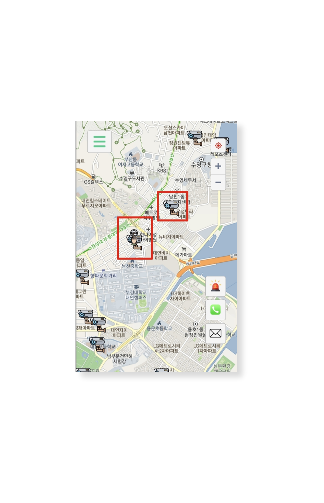

# 디자인 컨셉

## 색상&#x20;

#### ❑  페이지 디자인

* '안전'을 키워드로 하는 서비스임을 내포하기 위해 페이지 디자인에 사용될 색상을 고민하였고, 전체적으로 안정감을 느끼도록 안전을 나타내는 색인 초록색을 메인 컬러 계열로 채택하였습니다.
* 아래의 네 가지 색상이 페이지 디자인에 사용되었습니다.

.png>)

* #DEF6CD와 .png>)#C4F1DF 색상으로 그라데이션 효과를 준 인트로 화면을 제작하여 사용자가 웹사이트에 접속했을 때 전체적으로 초록색 계열의 색감이 주는 심리적인 진정을 느낄 수 있도록 합니다.
* .png>)#28F4A8과 .png>)#22CC8C 색상으로 글꼴 및 사이드바 아이콘 색을 작성하였습니다

#### ❑  경로 및 현재 위치 색

* 지도에 표시된 파란색(.png>)#4C4CFF)의 경로와 명확히 구별되도록 현재 위치 표시 아이콘으로는 빨간색(.png>)#ED0000)을 사용합니다.

## 애니메이션

#### ❑ 인트로

*

#### ❑ 사이드바

*

## 버튼 위치&#x20;

## 마커이미지  &#x20;

#### ❑ 안전시설물

#### ❑ 키워드 검색

#### ❑ 경유지&#x20;
